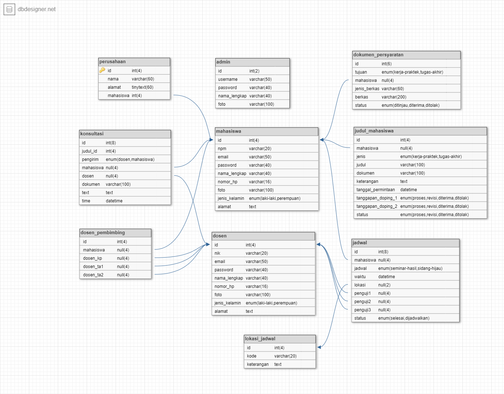

# Sistem Administrasi Tugas Akhir dan Kerja Praktek

## User Account

> Level Admin

```text
email : agungmasda29@gmail.com
username : admin
password : admin
```

> Level Dosen

```text
email : dosen@sistem.administrasi-takp.com
nik : 123456
password : dosen
```

> Level Mahasiswa

```text
email : mahasiswa@sistem.administrasi-takp.com
npm : 123456
password : mahasiswa
```

## Database Relationships



```txt
admin {
	id int(2)
	username varchar(50)
	password varchar(40)
	nama_lengkap varchar(40)
	foto varchar(100) null
}

dokumen_persyaratan {
	id int(6)
	tujuan enum(kerja-praktek,tugas-akhir)
	mahasiswa(4) > mahasiswa.id
	jenis_berkas varchar(60)
	berkas varchar(200)
	status enum(ditinjau,diterima,ditolak) def(ditinjau)
}

dosen {
	id int(4)
	nik varchar(20)
	email varchar(50) null
	password varchar(40)
	nama_lengkap varchar(40)
	nomor_hp varchar(16) null
	foto varchar(100) null
	jenis_kelamin enum(laki-laki,perempuan)
	alamat text null
}

dosen_pembimbing {
	id int(4)
	mahasiswa(4) > mahasiswa.id
	dosen_kp(4) null > dosen.id
	dosen_ta1(4) null > dosen.id
	dosen_ta2(4) null > dosen.id
}

jadwal {
	id int(8)
	mahasiswa(4) > mahasiswa.id
	jadwal enum(seminar-hasil,sidang-hijau)
	waktu datetime
	lokasi(2) > lokasi_jadwal.id
	penguji1(4) null > dosen.id
	penguji2(4) null > dosen.id
	penguji3(4) null > dosen.id
	status enum(selesai,dijadwalkan) def(dijadwalkan)
}

judul_mahasiswa {
	id int(4)
	mahasiswa(4) > mahasiswa.id
	jenis enum(kerja-praktek,tugas-akhir)
	judul varchar(100)
	dokumen varchar(100) null
	keterangan text null
	tanggal_permintaan datetime
	tanggapan_doping_1 enum(proses,revisi,diterima,ditolak) def(proses)
	tanggapan_doping_2 enum(proses,revisi,diterima,ditolak) def(proses)
	status enum(proses,revisi,diterima,ditolak)
}

konsultasi {
	id int(8)
	judul_id int(4)
	pengirim enum(dosen,mahasiswa)
	mahasiswa(4) > mahasiswa.id
	dosen(4) > dosen.id
	dokumen varchar(100) null
	text text null
	time datetime null
}

lokasi_jadwal {
	id int(4)
	kode varchar(20) null
	keterangan text
}

mahasiswa {
	id int(4)
	npm varchar(20)
	email varchar(50) null
	password varchar(40)
	nama_lengkap varchar(40)
	nomor_hp varchar(16) null
	foto varchar(100) null
	jenis_kelamin enum(laki-laki,perempuan)
	alamat text null
}

perusahaan {
	id int(4) pk increments
	nama varchar(60) increments
	alamat tinytext(60) increments
	mahasiswa int(4) increments > mahasiswa.id
}
```
